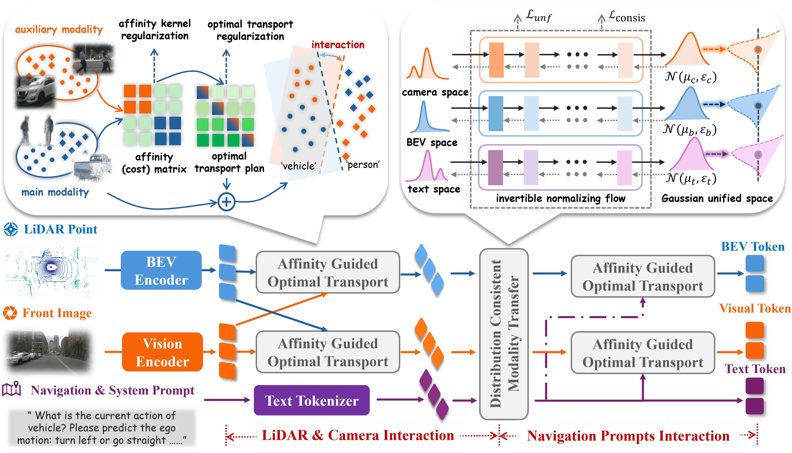
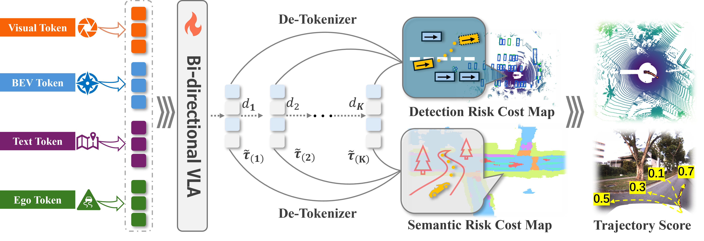

## method
### 1. Multi-modality Interaction


### 2. Multi-Tarjectory Planning and Optimization

## Installation

### 1. Create environment

```bash
conda create -n cmmi python=3.9 -y
conda activate cmmi
```

### 2. Install PyTorch (CUDA 12.4)

```bash
pip install torch==2.6.0 torchvision==0.21.0 torchaudio==2.6.0 \
    --index-url https://download.pytorch.org/whl/cu124
```

### 3. Install spconv

```bash
pip install spconv-cu124==2.3.8
```

### 4. Install mmcv

```bash
pip install mmcv==2.2.0 \
    -f https://download.openmmlab.com/mmcv/dist/cu124/torch2.6/index.html
```

> If no prebuilt wheel is available, build from source:
> ```bash
> git clone https://github.com/open-mmlab/mmcv.git && cd mmcv
> git checkout v2.2.0 && MMCV_WITH_OPS=1 pip install -e .
> ```

### 5. Install remaining dependencies

```bash
pip install -r requirements.txt
pip install -e .
pip install -e nuplan-devkit/
```

## Data Preparation

### NavSim dataset

Follow the [NavSim](https://github.com/autonomousvision/navsim) instructions to download the dataset, then export:

```bash
export NUPLAN_MAPS_ROOT="/path/to/dataset/maps"
export OPENSCENE_DATA_ROOT="/path/to/dataset"
export METRIC_CACHE_PATH="/path/to/metric_cache"
```

> `METRIC_CACHE_PATH` must be set with `export` — inline assignment is not inherited by evaluation subprocesses.

Download scripts are provided in `download/`:

```bash
bash download/download_maps.sh
bash download/download_navtrain.sh
```

### BEV feature cache

We precompute BEV features offline for stable evaluation. Download from [[link]] or generate:

```bash
export NAVSIM_EXP_ROOT="exp"
export OPENSCENE_DATA_ROOT="/path/to/dataset"
bash scripts/precompute_navtest_bev.sh     # navtest split (for evaluation)
python precompute_bev_features.py          # training split
```

Expected layout after generation:

```
data/
├── bev_cache/              # one .npz per scene token
├── navsim_103k_bev.jsonl
└── navsim_103k_bev_gt.jsonl
```

---

## Evaluation

Results are written to `exp/<name>/<timestamp>.csv`.

```bash
cd /path/to/wamflow+
conda activate cmmi
export METRIC_CACHE_PATH="/path/to/metric_cache"

bash scripts/evaluation/run_cmmi_bev_hybrid_eval.sh
```

To use a specific checkpoint:

```bash
CKPT=output/train/navsim_bev_lplan5_40k/checkpoint-40000 \
bash scripts/evaluation/run_cmmi_bev_hybrid_eval.sh
```

---

## Training

### Stage 1 — Scene Perception pretraining

Trains BEV segmentation and 3D detection heads with ground-truth supervision:

```bash
export NCCL_P2P_DISABLE=1
export NCCL_IB_DISABLE=1
bash scripts/sft_navsim_seg_det.sh
# Output → output/pretrain/seg_det/
```

### Stage 2 — CVLA model fine-tuning

Fine-tunes VLA model with BEV token injection and planning loss:

```bash
bash scripts/sft_navsim_bev_lplan5_40k.sh
# Output → output/train/navsim_bev_lplan5_40k/
```

Key settings in `config/sft_navsim_bev_lplan5_40k.yaml`:

```yaml
learning_rate: 5e-6
max_train_steps: 40000
batch_size: 1
accumulate_grad_batches: 2
mixed_precision: "no"
use_bev_tokens: false
plan_k: 1
```

---

## Acknowledgments

```
Our code was modified based on a refactoring of WAM-Flow and BEVFusion.
```


